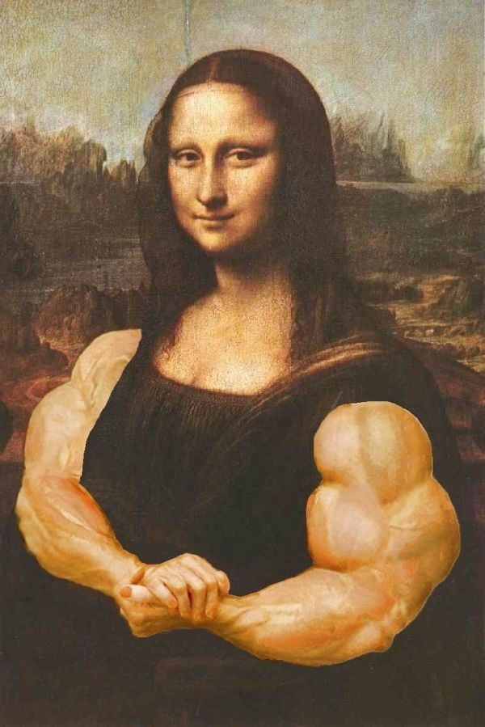
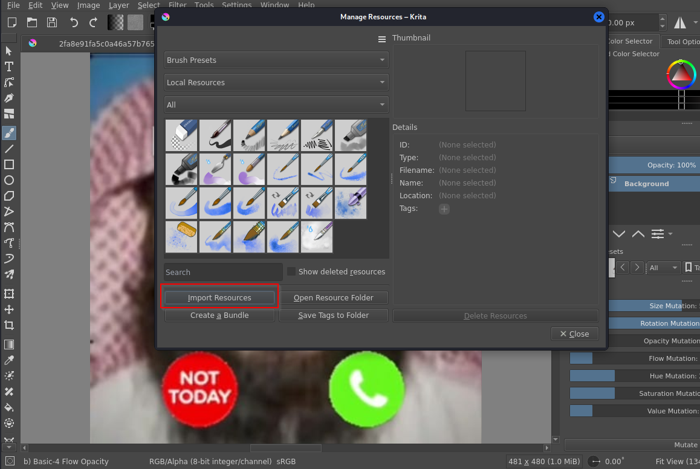
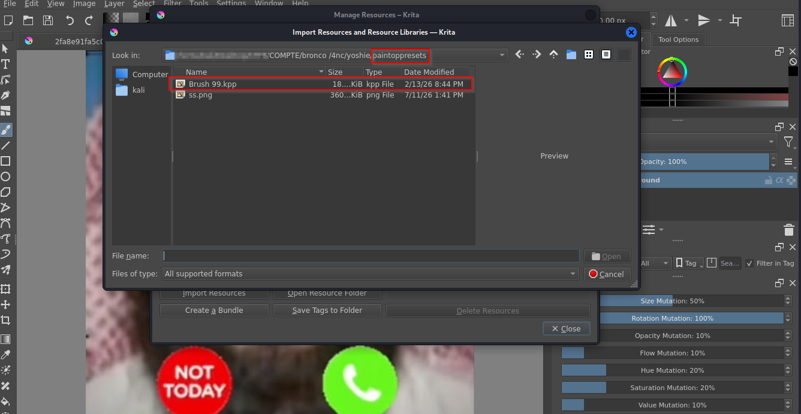
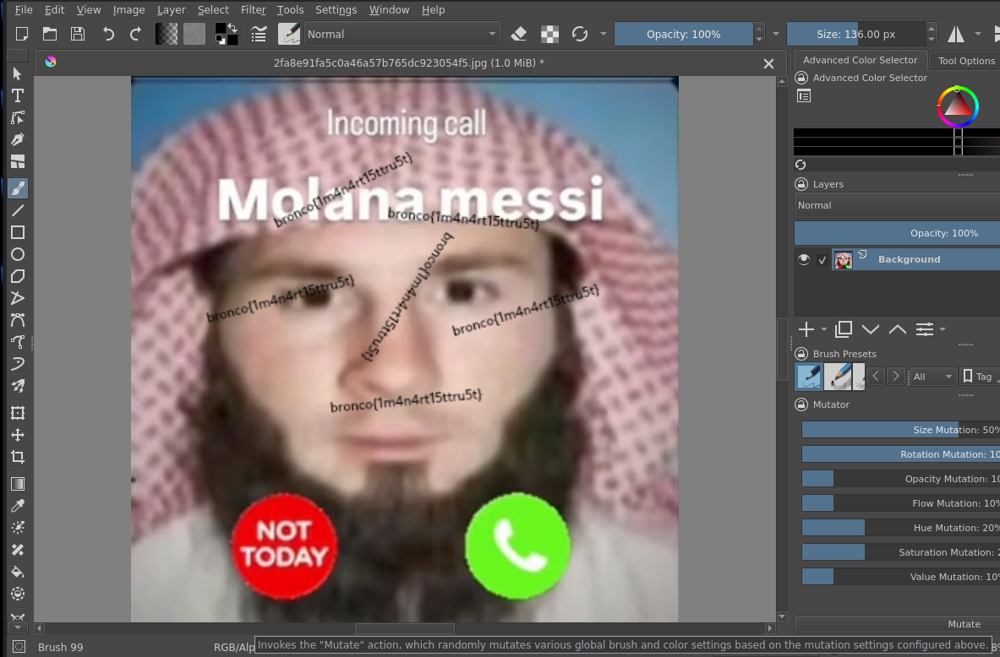

# Bundle 99 - BroncoCTF 2026 Writeup

## Challenge Description

> Yoshie found this random file lying around.
>
> Apparently someone said it's the **99th bundle of brushes**.
>
> What is that supposed to mean...
>
> **P.S.** This challenge can be solved without installing any software, but you'll have to find an online way to load the bundle.

---

The challenge provides a single file called `Bundle_99`.

I had no idea what it was, so I started with the `file` command.

```bash
file Bundle_99
```

Output:

```text
Bundle_99: Zip data (MIME type "application/x-krita-resourcebundle")
```

The file is simply a ZIP archive, so I extracted it.

```bash
unzip Bundle_99
```

```text
Archive: Bundle_99

extracting: mimetype
inflating: paintoppresets/Brush 99.kpp
inflating: preview.png
inflating: META-INF/manifest.xml
inflating: meta.xml
```

At first, I expected to find the flag inside one of the XML files, but there was nothing useful.

The interesting clue was the MIME type:

```text
application/x-krita-resourcebundle
```

After a little research, I discovered that this is a **Krita Resource Bundle**, which contains custom brushes for the Krita drawing application.



Although the challenge mentions that it can be solved online, I used a local installation of Krita.

The extracted bundle contains the following brush preset:

```text
paintoppresets/Brush 99.kpp
```

To import it, open:

```text
Settings → Manage Resources...
```

Then import the extracted brush preset.



Select the `Brush 99.kpp` file.



After importing it, select **Brush 99** from the brush list.


Now simply draw anywhere on the canvas.

Instead of drawing a normal brush stroke, the brush paints the flag directly.



## Flag

```text
bronco{1m4n4rt15ttru5t}
```

---

*Thanks for reading! ❤️*

> **Don't forget to send blessings upon Prophet Muhammad ﷺ.**
