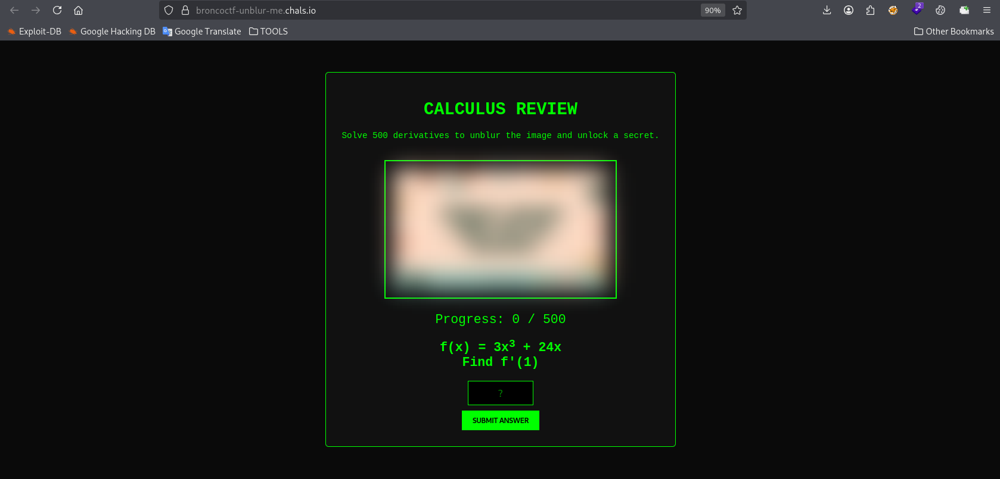
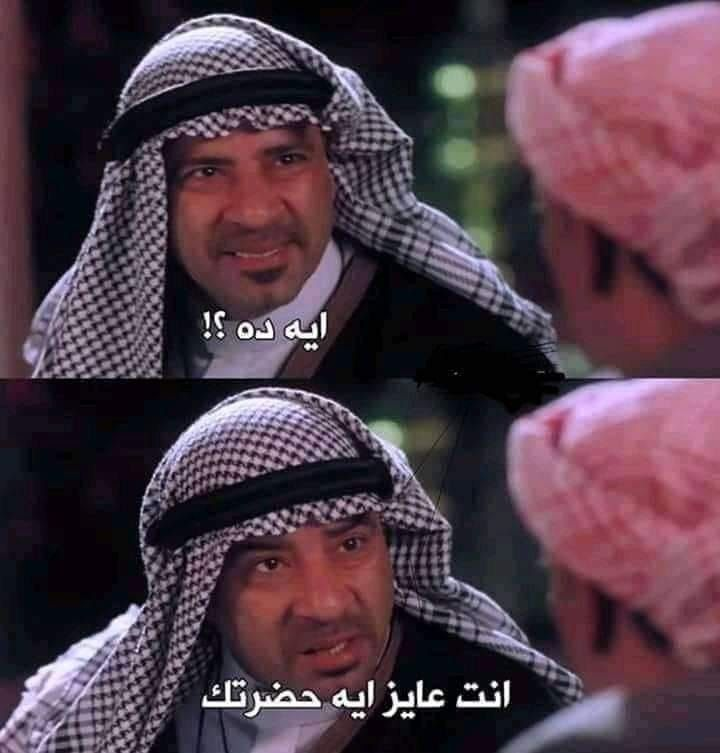
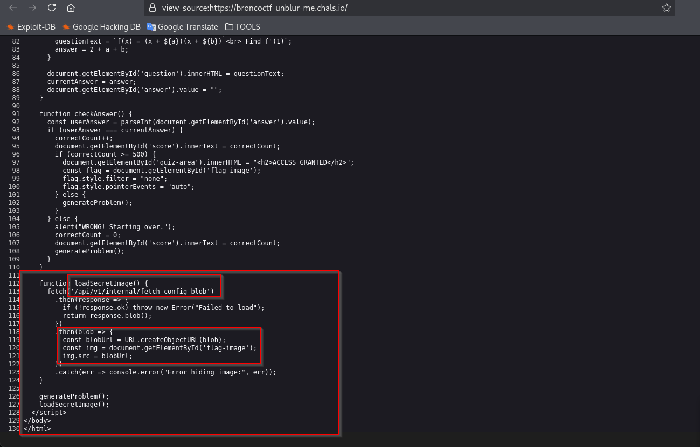
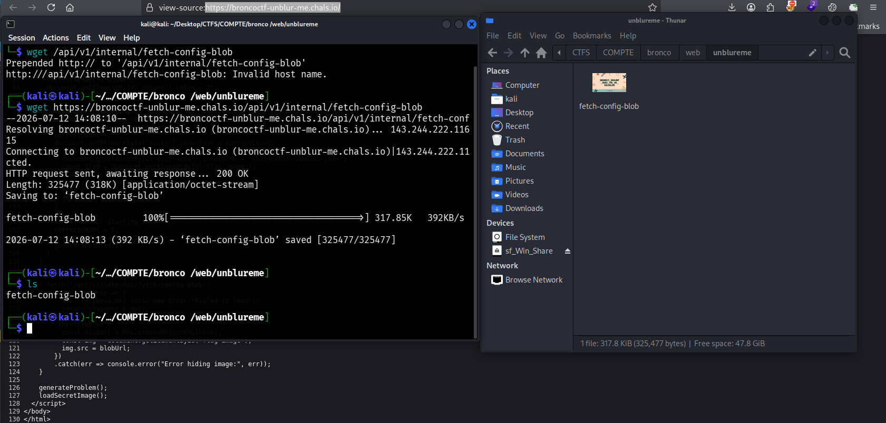
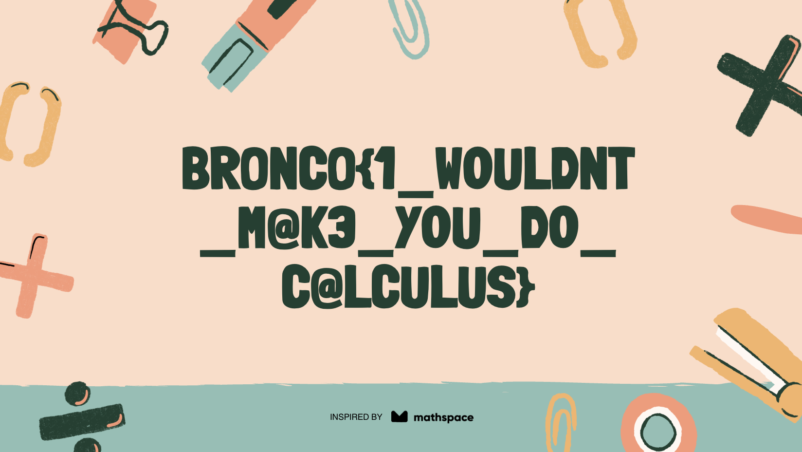

# Unblur Me - BroncoCTF 2026 Writeup
بسم الله الرحمن الرحيم  - اللهم صلي على سيدنا محمد 

## Challenge Description

> My friend tried to motivate me to review my derivatives by telling me that I could unlock a top-secret image after solving 500 problems on this website.
>
> Unfortunately for her, I believe in working smarter, not harder. So, is there a way to get the flag without doing any math?

**Challenge:**
<https://broncoctf-unblur-me.chals.io/>

---



I do love math, but I'm definitely not solving **500 calculus problems** just to reveal one image.



First, I viewed the page source using `Ctrl + U`.



While reviewing the JavaScript code, I noticed a function called `loadSecretImage()`.

This function requests the following endpoint:

```javascript
/api/v1/internal/fetch-config-blob
```

It fetches the image as a Blob and loads it into the page after solving the 500 questions.

So... what happens if we request that endpoint directly?



The endpoint returned the image immediately.

Let's open it.



The backend never checks whether we actually solved the 500 problems. The restriction exists only in the client-side JavaScript, so requesting the endpoint directly bypasses the intended challenge.

## Flag

```text
bronco{1_WOULDNT_M@K3_YOU_DO_C@LCULUS}
```


---

*Thanks for reading! ❤️*
*متنساش تصلي على النبي :>*
