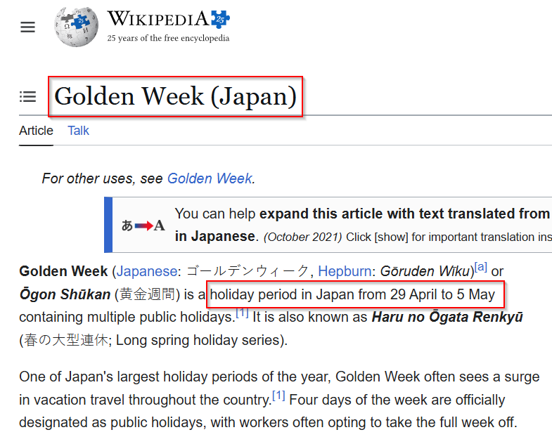
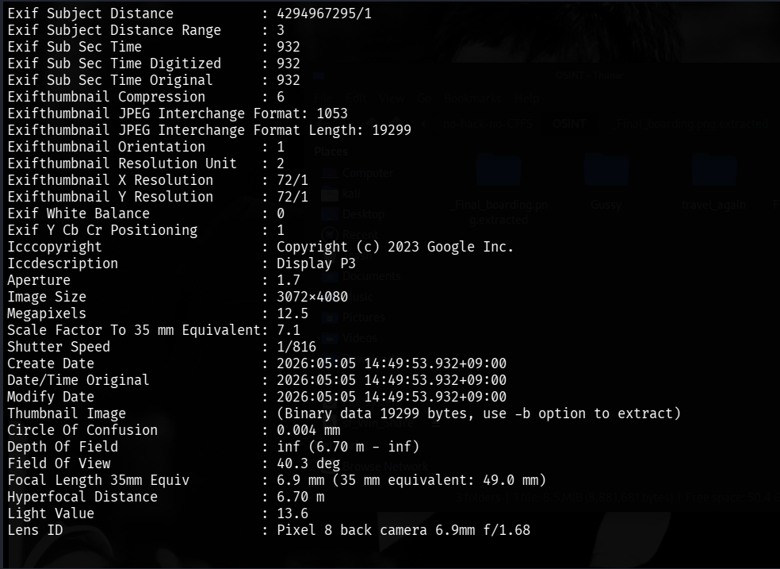
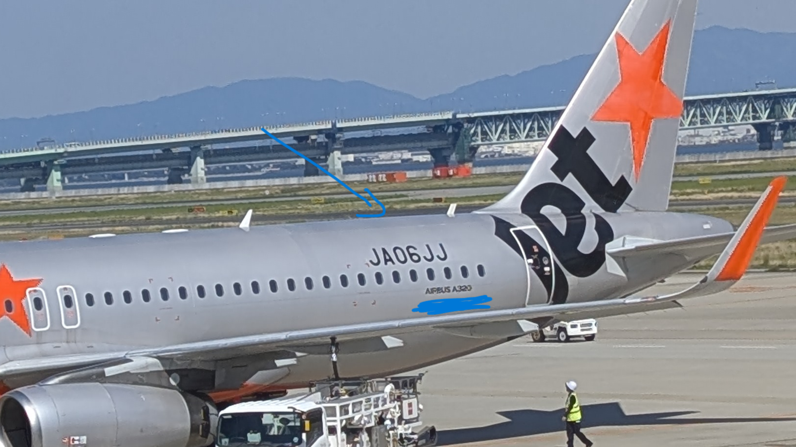
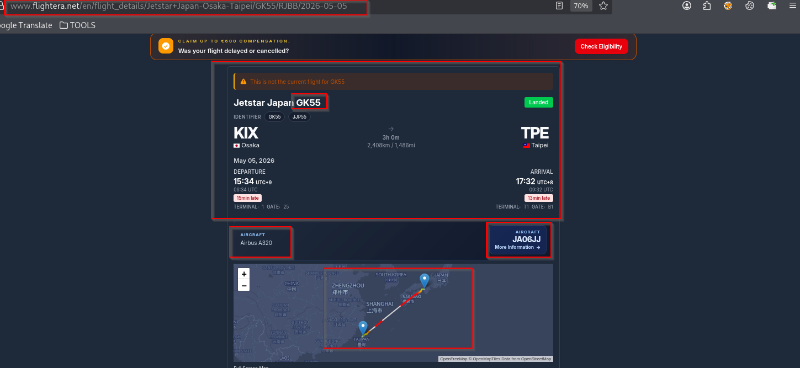

# OSINT Writeup - Final Boarding (NHNC CTF)

> **Category:** OSINT
> **Difficulty:** Easy
> **Competition:** NHNC CTF

## Challenge Description

On the last day of the trip, I stood in front of the boarding gate, ready to board my flight home.

That day in Japan marked the end of Golden Week, and the airport was packed with travelers preparing to return home.

Before boarding, I took a photo of the aircraft in front of me. Based on the aircraft information in the image and the clues provided, determine:

1. The date the photo was taken.
2. The IATA flight number of the flight.

**Flag Format**

```text
NHNC{YYYYMMDD_FLIGHT}
```

> Use the **IATA** flight number (e.g. `BR198`), **not** the ICAO callsign.

---

## Challenge Image


---

# Step 1 – Identify the Date

The most important clue is:

> *"That day in Japan marked the end of Golden Week."*

Golden Week in Japan ends on **May 5, 2026**, which immediately gives us the first part of the flag.

To verify this, I also checked the image metadata.





So the first part becomes:

```text
NHNC{20260505_XXXXX}
```

---

# Step 2 – Identify the Aircraft

After zooming into the image, the aircraft registration becomes readable.



The aircraft registration is:

```text
JA0JJ
```

Aircraft type:

```text
Airbus A320
```

Since aircraft registrations are unique, they can be used to retrieve historical flight data.

---

# Step 3 – Find the Flight

Searching flight tracking databases for aircraft **JA0JJ** on **2026-05-05** returns its scheduled flights.

By matching the timing and the challenge description, the correct flight is:

```text
GK55
```



Although flight tracking websites also display the ICAO callsign, the challenge specifically requests the **IATA flight number**, which is:

```text
GK55
```

---

# Final Flag

```text
NHNC{20260505_GK55}
```

---

## Tools Used

* EXIF Metadata Viewer
* Flight Tracking Databases
* Google Search
